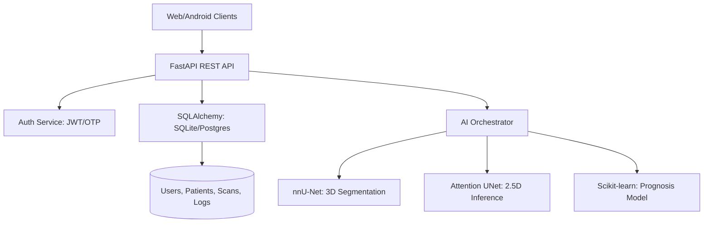

# Backend Architecture

## 1. System Overview
The backend is a high-performance **FastAPI** service that orchestrates user authentication, clinical data management, and the AI diagnostic pipeline. It is designed to handle large volumetric medical data (CBCT) while providing instant feedback through optimized 2.5D inference.

## 2. Component Diagram (Mermaid)

## 3. Data Flow
1.  **Ingestion**: Client uploads a `.nii.gz` volume via `multipart/form-data`.
2.  **Multimodal Verification**: If a clinical photo is provided, the backend computes a texture-based Laplacian variance to verify 3D findings.
3.  **Inference**:
    - **Fast Mode**: The `run_penta_planar_inference` logic extracts 5 strategic slices and runs an ensembled 2D model.
    - **Deep Mode**: Full 3D nnU-Net prediction is triggered if high-resolution segmentation is required.
4.  **Post-processing**: The engine extracts centerlines (skeletonization) and generates Base64 perspective stacks (Axial, Coronal, Sagittal).
5.  **Persistence**: User info, patient metadata, and clinical audit logs are stored in the database.

## 4. Key Services
- **`api.py`**: The entry point, defining endpoints and request schemas (Pydantic).
- **`database.py`**: Robust engine creator with Supabase/Postgres auto-detection.
- **`discovery.py`**: A **UDP Discovery Server** allowing mobile devices to find the local backend IP automatically within a surgical theatre network.
- **`auth_utils.py`**: Secure password hashing (bcrypt) and verification logic.
- **`email_utils.py`**: SMTP-based service for sending OTP verification codes.

## 5. Directory Organization
- `backend/app/`: Core application logic (API, models, utils).
- `backend/ml/`: The machine learning core.
    - `inference.py`: Production inference logic.
    - `postprocessing.py`: Anatomical reconstruction and OPG generation.
- `backend/demosnerve/`: Static/Demo high-fidelity tracing logic.
- `backend/utils/`: Shared utilities (e.g., custom logging).
