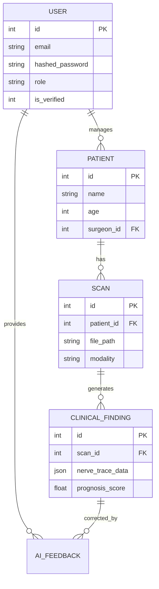

# Database Documentation

## 1. Database Architecture
The project uses a unified data access layer that supports two engines:
- **Development/Local**: **SQLite** (`clinical_data.db`) for zero-config local testing.
- **Production/Cloud**: **PostgreSQL** (compatible with Supabase) for multi-user synchronization.

## 2. ORM & Drivers
- **ORM**: SQLAlchemy.
- **Driver**: `psycopg2-binary` (for Postgres) and native `sqlite3`.

## 3. Entity-Relationship Diagram (Mermaid)

## 4. Table Schema Details
### `users`
Stores surgeons and administrators.
- `role`: "Admin" or "Surgeon".
- `is_active`: Controls account locking via the admin portal.

### `patients`
Stores clinical metadata for individual subjects.
- Automatically timestamped via `created_at`.

### `audit_logs`
Tracks critical system actions for clinical compliance.
- Columns: `user_email`, `action`, `timestamp`, `details`.

## 5. Configuration & Migration
- **Connection Method**: Connection URL provided via the `DATABASE_URL` environment variable.
- **Auto-Migration**: The backend (`api.py`) contains a `apply_migrations()` function that checks table schemas on startup and adds missing columns automatically, ensuring data continuity during updates.
