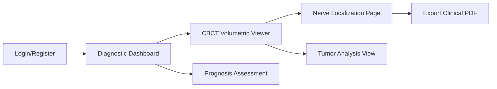

# Frontend Architecture

## 1. System Overview
The Web Frontend is a **Single Page Application (SPA)** built with **React 19** and **Vite**. It provides a "Surgical Control Center" interface for managing patient cases, reviewing AI findings, and generating clinical reports.

## 2. UI/UX Flow (Mermaid)

## 3. Architecture Pattern
- **Component-Driven**: UI is built using Atomic Design principles with reusable components in `src/components/ui/`.
- **Atomic State**: **Zustand** is used for global state management, allowing for high-performance updates during volume slice navigation.
- **Layered Rendering**: The CBCT viewer uses multiple `img` layers with `mix-blend-screen` and `brightness` filters to overlay AI traces on raw anatomy.

## 4. Key Components
- **`CBCTViewerPage`**: The primary hub for NIfTI ingestion and slice-by-slice inspection.
- **`NerveLocalizationPage`**: Dedicated view for bilateral IAN tracing with dynamic line thickness and opacity controls.
- **`ExplainableAIPage`**: Displays Grad-CAM heatmaps and SHAP feature importance charts.
- **`MedicalCard` / `MetricCard`**: Styled containers for consistent clinical data representation.

## 5. Technology Highlights
- **Vite**: Provides instant Hot Module Replacement (HMR) for a fast development cycle.
- **TailwindCSS**: Handles complex responsive layouts, including a "Quad-View" for 3D reconstruction.
- **Framer Motion**: powers high-fidelity transitions between clinical pages.

## 6. Directory Organization
- `src/pages/`: Modular page views.
- `src/components/`: Reusable components (UI, Navigation, Loader).
- `src/store/`: Zustand state definitions (`useStore.js`).
- `src/api/`: Endpoint configurations and Axios instances.
- `public/`: Assets like the service worker and manifest for **PWA** support.
