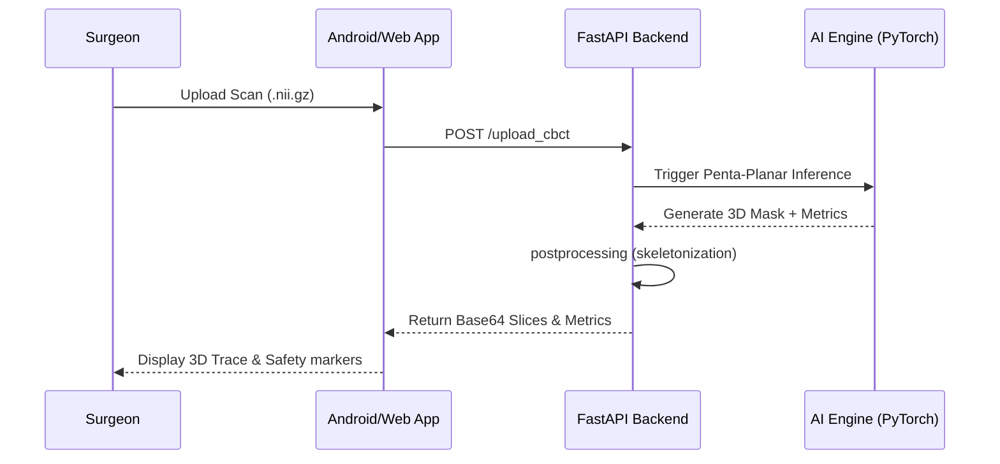
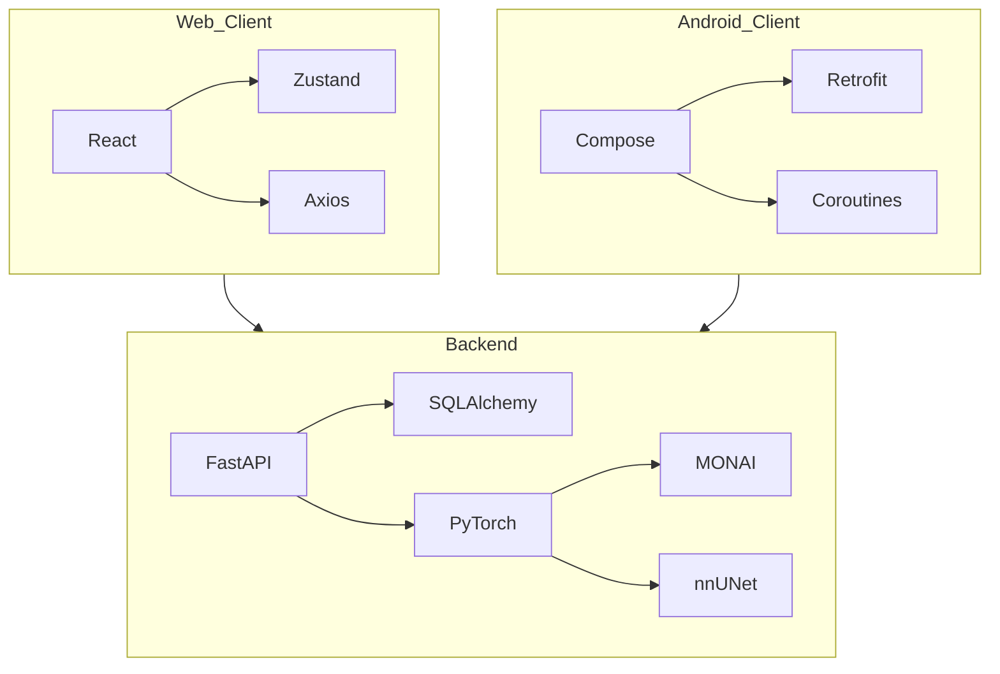

# System Specifications

## 1. Hardware Requirements
| Component | Minimum | Recommended |
| :--- | :--- | :--- |
| **RAM** | 16 GB | 32 GB (for handling 3D CBCT volumes) |
| **GPU** | 4 GB VRAM (CUDA) | 8 GB+ VRAM (e.g., RTX 3060+) |
| **CPU** | Quad-core (Intel i5/Ryzen 5) | Hexa-core+ (Intel i7/Ryzen 7) |
| **Storage** | 5 GB Free | 20 GB+ (for datasets and models) |

## 2. Software Versions
- **Operating System**: Windows 10/11 (for `.bat` scripts), Linux (for high-speed training).
- **Python**: 3.10.12 / 3.13.0
- **Node.js**: 20.x
- **Java**: JDK 17 (Azul Zulu recommended)
- **Android Studio**: 2024.1.1 (Ladybug) or newer.

## 3. Compatibility
- **Browser**: Chrome 90+, Edge 90+, Safari 14+.
- **Android**: API 24 (Android 7.0) to API 35 (Android 15).
- **CUDA**: 11.8 or 12.1 (for PyTorch acceleration).

## 4. Architectural Schemas
### Overall System Flow (Mermaid)

### Dependency Graph (Mermaid)

## 5. Performance Metrics
- **Average Inference Time (2.5D)**: ≈ 1.2s
- **Average Inference Time (3D Fullres)**: ≈ 120s - 180s
- **API Response Latency**: < 200ms (standard endpoints).
- **DICE Accuracy (Nerve)**: Target > 0.76 (Clinical validation phase).
